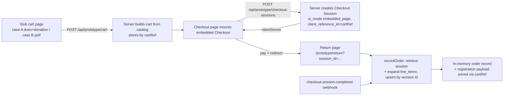

# Prototype spike — cart → Checkout Session → embedded Checkout → webhook

Throwaway code answering the wayfinder ticket **Prototype: Cart to Checkout
Session to webhook spike** (#10 on `Chapster87/pghrugby`): _how should the
cart → Checkout Session creation → embedded Checkout → success page → webhook
flow be structured in this app?_

Everything under `src/app/prototype/`, `src/app/api/prototype/`, and
`src/lib/prototype-stripe/` is the spike. It is deliberately rough, in-memory,
and marked `PROTOTYPE`. Delete it (and the middleware skip in `src/middleware.ts`)
after the verdict lands. The one non-throwaway change it made: added the
`stripe` npm package (v22, the production SDK) to `package.json`.

## Run it

1. Add to `pghrugby/nextjs/.env.local`:

   ```bash
   STRIPE_SECRET_KEY=sk_test_...          # test-mode secret key
   NEXT_PUBLIC_STRIPE_PUBLISHABLE_KEY=pk_test_...   # test-mode publishable key
   STRIPE_WEBHOOK_SECRET=whsec_...        # from `stripe listen`, for the webhook
   ```

   (`NEXT_PUBLIC_STRIPE_KEY` is used as a fallback publishable key; test-mode
   works fine — use card `4242 4242 4242 4242`.)

2. Start the app: `pnpm dev` (root) — serves on `http://localhost:8000`.

3. Open `http://localhost:8000/prototype/cart`. Build a cart (either case),
   hit **Pay with Stripe →**, pay with the test card.

4. After payment you land on the return page showing the recorded order
   (fast path). For the webhook path:

   ```bash
   stripe listen --forward-to localhost:8000/api/prototype/webhook
   ```

   then repeat a payment and check `GET /api/prototype/orders` (or the Stripe
   CLI output).

Note: the spike runs without the Medusa backend (the middleware skips
`/prototype`), and all state is in memory — a dev-server restart wipes it.

## The flow



## Structure decisions the spike embodies

- **Two server steps: cart, then session.** The client only posts selections
  (`flow`, `quantity`, `donationIndex`, `golfers`); the server builds the cart
  from `catalog.ts` and returns computed items/total. Amounts are never
  client-dictated (research: "the cart is server-authoritative").
- **`client_reference_id` = cartRef** — the reconciliation key. Registration
  payloads live beside the session in the site store, never in Stripe metadata
  (research §5/§6).
- **Embedded full-page Checkout** (`ui_mode: embedded_page`): session created
  server-side, `return_url` with `{CHECKOUT_SESSION_ID}` template, client
  mounts via `initEmbeddedCheckout`.
- **One shared `recordOrder(sessionId)`** used by both the return page (fast
  path) and the webhook (authoritative). Idempotent upsert keyed by session id;
  retrieves with `expand: ["line_items"]`.
- **Webhook handler**: signature-verified with `stripe.webhooks.constructEvent`,
  acks everything, fulfills on `checkout.session.completed`.
- **Grouped case uses a fixed-amount donation preset** — a pay-what-you-want
  amount must be a sole line item, so it can never share the dues session
  (research §3; the PWYW UX is a separate graduated ticket).
- **Sessions expire in 30 minutes** (`expires_at`) — flagging the abandoned-cart
  question the research raised.

## What to react to

- Golf registration modeled as **one line item with quantity N** (per-golfer
  data in the payload). Alternative: N line items at quantity 1.
- The two-step cart→session split vs. collapsing cart-building into session
  creation.
- The in-memory orders shape vs. what the Supabase `orders` table should hold
  (nullable shipping slot, registration JSONB, etc. — the research's
  consequences §8).
- Client uses **CDN Stripe.js** because the installed `@stripe/stripe-js`
  predates `initEmbeddedCheckout`; production should upgrade
  `@stripe/stripe-js` + `@stripe/react-stripe-js` and use the React
  `EmbeddedCheckoutProvider`. Upgrading now was skipped to keep the still-live
  Medusa checkout untouched — worth a decision.
- Server-side uses the real `stripe` SDK (v22) — the production path.

## Verdict (HITL — landed 2026-08-24)

- **Registration quantity:** one line item × N; per-golfer payload rides
  beside the session. (Spike fix during review: the cart page now passes the
  flow explicitly to the cart route — a stale-state closure could build the
  wrong case — and golfer rows sync with the quantity input so one click
  captures the full payload.)
- **Cart seam:** keep the two-step split (cart route → session route).
- **Orders:** one table — session id PK, `client_reference_id`, flow, amounts,
  customer email, line items JSONB, nullable registration JSONB, nullable
  shipping JSONB.
- **Client packages:** production upgrades `@stripe/stripe-js` +
  `@stripe/react-stripe-js` and uses the React embedded provider, as part of
  the checkout-module replacement.
- **Session expiry:** use Stripe's default; the 30-min `expires_at` here was a
  spike placeholder.

Hands off to the orders-schema prototype and the checkout-module replacement;
delete this spike once those land.
